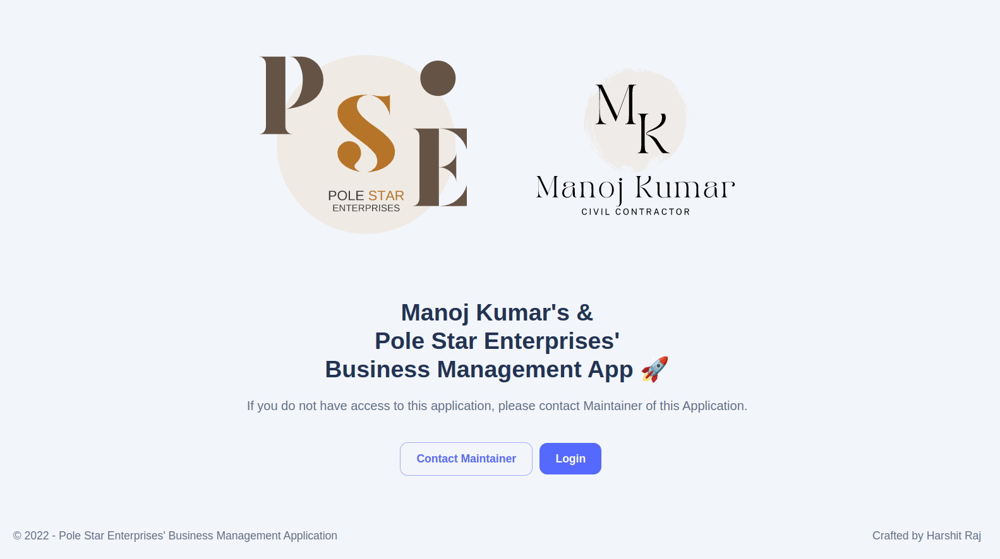
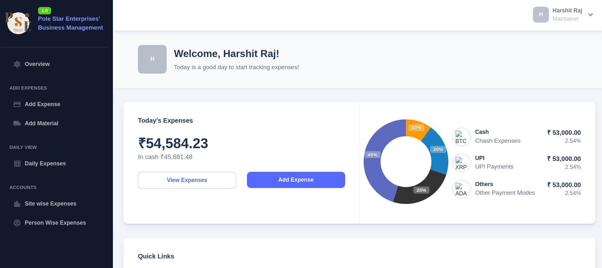

# Business Management App

**Customized for Pole Star Enterprises**



## Admin side


## Local Setup

First, run the development server:

```bash
yarn # to install dependencies
yarn dev
```

Open [http://localhost:3000](http://localhost:3000) with your browser to see the result.

